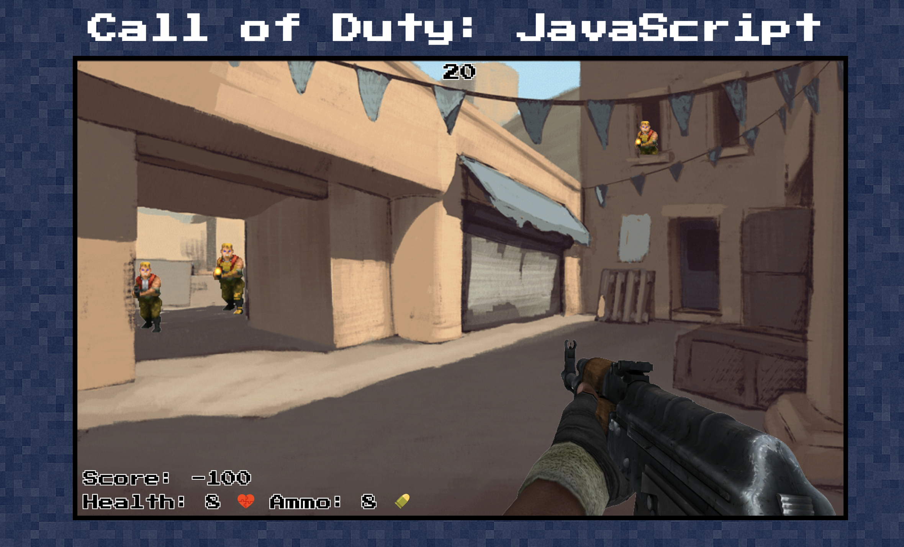

# proj1-fpsgame
### Browser Game using JavaScript, CSS, and HTML 

## User Story
- Screen in the middle of the page
- Start button once pressed, initializes game
- Game UI loads : Hearts or HP, score, ammo, Crosshair cursor
- Level Begins and map loads
- Click on the villain score++ 
- villians disappear if clicked, if not clicked on for 1.75 - 2.25 seconds, player hp--  and score--
- To win the level, user must be alive during x amount of time and have x amount of score 
